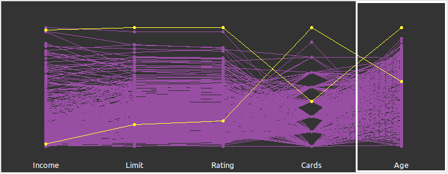

---
title: "Statistical Machine Learning: Midterm Report"
author: "Oussama Azizi  A07922203"
header-includes:
  - \documentclass[fontset=ubuntu,UTF8,a4paper, 11pt]{ctexart}
  - \usepackage{ctex}
  - \usepackage[utf8x]{inputenc}
output:
  html_document: default
  pdf_document:
    latex_engine: xelatex
editor_options: 
  chunk_output_type: console
--- 

```{r setup, include=FALSE}
knitr::opts_chunk$set(echo = TRUE)
set.seed(200)
library(kableExtra)
source("Rscript.R")
```

#1. Exploratory Data Analysis
We look at the summary of the data :
```{r echo = FALSE,fig.align="center", message=FALSE, warning=FALSE,fig.height = 5, fig.width = 4}
summary(credit)
```
We notice that the classes are imbalanced : Indeed, $50\%$ of participants are Caucasians, and only $25\%$ are African American and $25\%$ Asian. To address this issue, we perform the Synthetic Minority Over-sampling Technique (SMOTE) and we obtain the following result :
```{r echo = FALSE,fig.align="center", message=FALSE, warning=FALSE,fig.height = 5, fig.width = 4}
summary(credit1$Ethnicity)
```
Hence we have $42.85\%$ proportion of African American $20.63\%$ of Asian and $36.50\%$ of Caucasian which is more balanced than the previous proportions.
Using $Ggobi$ we visualize the multivariate parallel plot to check if there are some outliers :
```{r pressure, echo=FALSE, fig.cap="A caption", out.width = '100%'}

```
We notice that the observation $324$ and $384$ are potential outliers, we hence delete them from the dataset.
We use the z-standardization to normalize the data for algorithms  that are sensitive to scaling such as SVM for which features with higher variance have larger effect on the margin.
We plot boxplots for each explanatory variable:

```{r echo = FALSE,fig.align="center", results='hide', message=FALSE, warning=FALSE,fig.height = 5, fig.width = 4}
library(ggplot2)
library(gridExtra)
multiplot(plotlist=myboxplots,cols=4,rows=2)
```
We conclude that there are few leverage points but we won't drop them since they don't affect that much the results compared to outliers. We plot the histograms for each explanatory variable for each class : \n\n\n

```{r echo = FALSE,fig.align="center", results='hide', message=FALSE, warning=FALSE, fig.height = 5, fig.width = 4}
multiplot(plotlist=myplots,cols=2,rows=4)
```

The first observation that we notice is that all the classes overlap for every explanatory variable, which might be an indicator of bad explanatory variables selection. This will make the classification process difficult to achieve and will lead to very poor performance as we will see. To confirm this, we use the T-distributed Stochastic Neighbor Embedding (T-SNE) to visualize the data in 2 dimensions:
```{r,echo = FALSE, fig.align="center", results='hide', message=FALSE, warning=FALSE, fig.height = 4, fig.width = 4}
plot(tsne_out$Y,col=topo.colors(3), asp=1,xlab="TSN1",ylab="TSN2",border=F,main="T-SNE Transformation")
legend(10,40,legend=levels(credit$Ethnicity),col=credit$Ethnicity,fill=topo.colors(3), cex=0.7)
```
The second observation is that the distribution of features for each class are either right skewed or left skewed which violates the multivariate normality assumption, since joint normality implies marginal one.


# 2. Single Learners
For each single classifier,we use 10-fold Cross-validation to estimate the true error and we use the latter as a metric to compare between these models. The ROC would have been a good metric if we didn't solve the problem of imbalanced classes and if we had only two classes.

## 2.1. LDA and QDA
### Checking LDA and QDA assumptions
LDA and QDA requires that the predictors are normally distributed for each class. As we have seen from the histograms of features, the distributions are either left or right skewed but not normal. We perform a Mardia's test to make sure that it is the case :
```{r,echo = FALSE,fig.align="center", message=FALSE, warning=FALSE, fig.height = 4, fig.width = 4}
mvntest$multivariateNormality
```
As we see, the predictors marginal distribution didn't pass the Mardia's test for kurtosis nor the skewness one for normality.
Another condition is that the covariance matrix should be the same for the outcome across all class groups.

```{r,echo = FALSE,fig.align="center", results='hide', message=FALSE, warning=FALSE, fig.height = 4, fig.width = 4}
plotboxvar<-list()
for(i in features) {
  plotboxvar[[i]] <- ggplot(credit2, aes_string(x = "Ethnicity", y = i, col = "Ethnicity", fill = "Ethnicity")) + 
    geom_boxplot(alpha = 0.2,lwd=0.3) + 
    theme(legend.position = "none") + 
    scale_color_manual(values = c("purple", "cadetblue4","coral2")) 
  scale_fill_manual(values = c("purple", "cadetblue4","coral2"))
}
do.call(grid.arrange, c(plotboxvar, nrow = 2,ncol=4))
#print(do.call(grid.arrange, c(plotboxvar, nrow = 2,ncol=4)))
```

Except for Education, All the other predictors have different Covariances accross the space groups. To assess this issue, we are going to run a Box's M test, even if it is sensible when multivariate normality is not verified: 
```{r,echo = FALSE,fig.align="center", message=FALSE, warning=FALSE, fig.height = 4, fig.width = 4}
boxm
```
We can clearly see that the $p-value << 0.05$ which indicates high evidence against the null hypothesis $H_0 :  The \space covariance \space matrices \space  of \space the \space Ethnicity \space variable \space are \space equal \space across \space all \space groups \space .$ 
We can also perform a Levene's test which is more relevant since the data is not normal: 
```{r,echo = FALSE,fig.align="center", message=FALSE, warning=FALSE, fig.height = 4, fig.width = 4}
print("Cards~Ethnicity")
leveneTest(Cards~Ethnicity,credit2)
print("Balance~Ethnicity")
leveneTest(Balance~Ethnicity,credit2)
print("Age~Ethnicity")
leveneTest(Age~Ethnicity,credit2)
print("Rating~Ethnicity")
leveneTest(Rating~Ethnicity,credit2)
```
We conclude that apart from the variable $Cards$ the covariances seem to be homogenious. Again the homogeneous covariance assumption is violated. We should expect the LDA to perform bad and QDA better since it is not affected by the variance-covariance heterogeneity.
We perform 10-fold Cross validation to estimate the true error of both LDA and QDA.
We plot the confusion matrix for both classifiers :

```{r,echo = FALSE,fig.align="center", results='hide', message=FALSE, warning=FALSE, fig.height = 4, fig.width = 8}
multiplot(LDA_cfm,QDA_cfm,cols=2)
```

On the left, the confusion matrix of LDA indicates an estimate true error of $43.1\%$ while the confusion matrix of QDA indicates an estimate true error of $51.1\%$.

## 2.2. Support Vector Machine
We use the default settings for kernel for SVM, and a 10-fold cross validation to find the best values for the parameter $\gamma$ and the cost $c$. To serve this purpose, we make a grid search for the best $(c,\gamma)$ in the space $[0.1,15] \times [0.5,5]$.

```{r,echo = FALSE,fig.align="center", results='hide', message=FALSE, warning=FALSE, fig.height = 4, fig.width = 4}
plot(tobj, xlab = "gamma", ylab="C",nlevels = 50,col="cadetblue4")
tobj$best.parameters
tobj$best.performance
```
The best value of the pair $(c,\gamma)$ is $(6.1,2)$ which leads to an apparent error of $15.15\%$. We test the model on the test set.
We obtain the confusion matrix resulting of the 10-fold cross validation :

```{r,echo = FALSE,fig.align="center", results='hide', message=FALSE, warning=FALSE, fig.height = 4, fig.width = 4}
library(ggplot2)
library(gridExtra)
print(ggplotConfusionMatrix(SVM_cfm))
```
According to the 10-fold Cross-validation the true error is estimated to $15.9\%$.

## 2.3. Decision Tree
For this part we will develop a decision tree model based on the previous features. For this purpose we split the data into training set and test set and we use the $rpart$ function of $rpart$ library, which builds a decision tree using the training set and estimates the missclassification error using 10-fold Cross-validation. 
We obtain the following Error versus Tree size graph:

```{r,echo = FALSE,fig.align="center", results='hide', message=FALSE, warning=FALSE, fig.height = 4, fig.width = 4}
set.seed(220)
plotcp(DT)
```

We noticed that the missclassification error never goes down below $0.1$, hence the 1-SE rule cannot be applied to choose the ideal tree size. We will also note that, even with 10 fold-cross validation we do not obtain consistent missclassifcation errors as we run the code several times. This can be explained by the fact that decision trees are unstable to very small variations especially that the distribution of predictors overlap. It would have hence be better if we had a larger dataset or other predictors. However this issue can be solved using Ensemble methods. 
The maximum tree size gives us an accuracy of $`r I(base_accuracy*100)`\%$. We use postpruning to have a compromise between tree size and missclassification error with a complexity parameter of $cp = 0.011 \space$  which gives us a very large tree :

```{r,echo = FALSE,fig.align="center", results='hide', message=FALSE, warning=FALSE, fig.height = 6, fig.width = 6}
rpart.plot(DT_postprun,box.palette = "RdBu",shadow.col="gray",nn=T,fallen.leaves= F,varlen = 5)
```

The accuracy of the pruned tree is  $`r I(accuracy_postprun*100)`\%$.

## 2.4. Logistic discrimination
In this part, we construct a multinomial logistic classifier using the $multinom$ function of the $nnet$ package. We construct the model using a training set from the total data set. 
```{r,echo = FALSE,fig.align="center", results='hide', message=FALSE, warning=FALSE, fig.height = 6, fig.width = 6}
multilogmodel.fit
```
By looking at the deviance we should expect a low accuracy on the test set.
The confusion matrix for the test set is as following:

```{r,echo = FALSE,fig.align="center", results='hide', message=FALSE, warning=FALSE, fig.height = 4, fig.width = 4}
ggplotConfusionMatrix(multilog_cfm)
```

The Multinomial logistic classifier performs as poorly as the LDA classifier with an accuracy of $`r multilog_testacc`\%$.

## 2.5. KNN
We perform a K-Nearest Neighbors algorithm using the $caret$ package. We split once again the data to training set and a test set and we perform a 10-fold Cross Validation using the training to obtain the best value of $K$. 

```{r,echo = FALSE,fig.align="center", results='hide', message=FALSE, warning=FALSE, fig.height = 4, fig.width = 4}
print(knn_accuracyplot)
```

It seems that the best value is $K=1$ with a accuracy of $`r knn_trainacc`\%$. 
We make predictions on the test test and we obtain the following confusion matrix:

```{r,echo = FALSE,fig.align="center", results='hide', message=FALSE, warning=FALSE, fig.height = 4, fig.width = 4}
ggplotConfusionMatrix(knn_cfm)
```

Our model have a good accuracy on the test set : $`r knn_testacc`\%$, but still doesn't outperform SVM.

## 2.6. Conclusion
In this first part, we have seen $6$ different classifiers and used the missclassification error as a metric to assess their performance. To conclude we can say that SVM has been the most effective algorithm and LDA and the logistic classifier the less effective ones. We predict the $Ethnicity$ of participants in the data in the $Test.txt$ file , using the obtained SVM algorithm.
First of all, we normalize data using the the z-standardization with the sample means and standard errors for each feature of the first dataset, since the number of observations in the $Test.txt$ file is much lower than the total number of observations of the first dataset.
Using the SVM model that we created earlier we obtain the following predictions:

```{r,echo = FALSE,fig.align="center", message=FALSE, warning=FALSE}
library(kableExtra)
knitr::kable(TestSVM) %>% kable_styling()
print("hello")
knitr::kable(TestSVM)
```

# 3. Ensemble methods
## 3.1. Random Forest
We perform a random forest using a number trees to grow of $m=2 \approx \sqrt{7}$ since we use $7$ explanatory variables.
We obtain the following confusion matrix : 

```{r,echo = FALSE,fig.align="center", results='hide', message=FALSE, warning=FALSE, fig.height = 4, fig.width = 4}
ggplotConfusionMatrix(rf_cfm)
```

We can see that performing a Random Forest has a huge impact on the decision tree it doubles it's accuracy.

## 3.2. Gradient boosting
We make a model of gradient boosting using a total number of trees of $5000$ and an interaction depth of $6$, this results in the following confusion matrix:
```{r,echo = FALSE,fig.align="center", results='hide', message=FALSE, warning=FALSE, fig.height = 4, fig.width = 4}
ggplotConfusionMatrix(boost_cfm)
```
Surprisingly the Gradient boosting model performs worse than the Random Forest.

# 4. Adding more explanatory variables

In this section we introduce the remaining categorical variables $Gender \space$, $Student \space$ and $Married \space$ and we use decision rules to make the classification. Since these categorical variables are binary, we don't need to add new dummy variables to the data.

# 4.1. Naïve Bayes 

We perform a 10-fold cross validation in order to estimate the true accuracy of the Naive Bayes classifier

```{r,echo = FALSE,fig.align="center", results='hide', message=FALSE, warning=FALSE, fig.height = 4, fig.width = 4}
ggplotConfusionMatrix(NB_cfm)
```

The accuracy of the Naive Bayes classifier is very low as we can see. This is probably due to the fact that the features are not independent. A typical violation of this independence assumption is the possible correlation between predictors, we can imagine that being a student is correlated with being younger and having a lower income, and being married correlated with being older and having a higher income since married people tend to be older, hence they tend to be more experienced in their jobs. 

# 4.2. Decision Tree

The second decision rule model that we use is the Decision Tree model. We obtain the following Error versus Tree size for the traning set:

```{r,echo = FALSE,fig.align="center", results='hide', message=FALSE, warning=FALSE, fig.height = 4, fig.width = 4}
set.seed(102)
plotcp(DT2)
```
We choose the complexity parameter $cp = 0.014$ and we obtain the following confusion matrix for the test set:

```{r,echo = FALSE,fig.align="center", results='hide', message=FALSE, warning=FALSE, fig.height = 4, fig.width = 4}
ggplotConfusionMatrix(DT2_cfm)
```

The Decision Tree gained about $5\%$ in Accuracy by adding the categorical features and performes better than the Naive Bayes Classifier. We are going to choose it to predict the Ethnicity of participants in the $Text.txt$ file. We obtain the following predictions :

```{r,echo = FALSE, message=FALSE, warning=FALSE,results = 'asis'}
library(kableExtra)
TestDT2 %>%
  kable() %>%
  kable_styling()
knitr::kable(TestDT2, caption = "A Knitr table.") %>% kable_styling()
```

# 5. Conclusion:
In this project we performed a classification on a categorical data using multiple approaches. The SVM model seems to be the best candidate for this problem followed with KNN and Random Forest respectively. 
